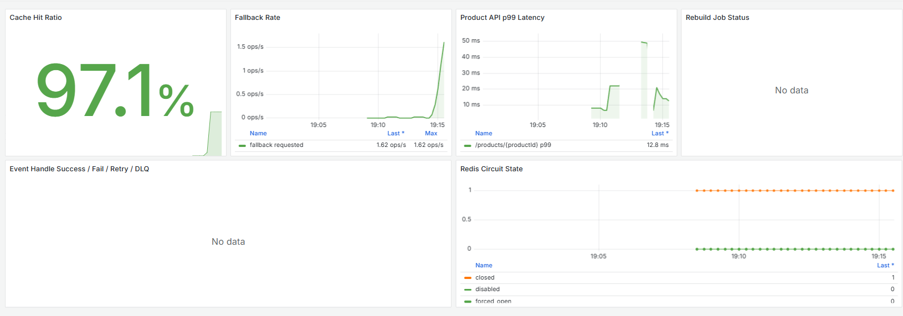

# Product Cache Service

[](https://github.com/jjd0922/product-cache-service/actions/workflows/ci.yml)
[](https://codecov.io/gh/jongdae/product-cache-service)
[]()
[]()
[]()

상품 조회 성능과 운영 안정성을 함께 고려해 설계한 멀티 모듈 기반 백엔드 서비스다.

단순 CRUD API가 아니라 Redis 캐시, Cache-Aside, 누락 캐시 복구, 캐시 스탬피드 방어, 관리자용 캐시 재구축, 이벤트 기반 갱신, 분산 트레이싱, 장애 대응까지 포함해 실제 운영 환경에서 자주 마주치는 문제를 구조적으로 다루는 데 초점을 맞췄다.

## Highlight

- 단건 조회 p99 **1318.34ms → 17.19ms**, DB 부하 **568.40/s → 27.78/s (-95.1%)** *(k6 측정, `benchmark.md` 참고)*
- Hot/Cold 조회는 p99 **246.34ms → 16.86ms**, 다건 조회는 DB 부하 **-99.0%** 대신 latency trade-off 발생
- Hot key TTL 동시 만료 시에도 DB 조회는 1회로 수렴 — **로컬 single-flight + Redis 분산 락**
- 존재하지 않는 키 폭주에도 DB fallback이 폭주하지 않음 — **negative caching**
- Redis 완전 다운 상황에서도 DB가 무너지지 않음 — **Resilience4j Circuit Breaker + Bulkhead**
- 캐시 read·write·fallback·rebuild·event 전 흐름이 단일 trace에 — **OpenTelemetry + Jaeger**
- 운영 로그는 JSON 구조화 + requestId/userId MDC + 민감정보 마스킹 적용

## 기술 스택

| 영역 | 사용 기술 |
|---|---|
| 언어/런타임 | Java 17 |
| 프레임워크 | Spring Boot 3.x, Spring Data Redis, Spring Data JPA, Spring Security |
| 캐시 | Redis 7.x, Redis 기반 분산 락 |
| DB | MySQL 8.0, Spring Data JPA |
| 관측성 | Micrometer, Prometheus, Grafana, OpenTelemetry, Jaeger, JSON structured logging |
| 회복성 | Resilience4j (Circuit Breaker, Bulkhead), Spring Retry |
| 테스트 | JUnit 5, Mockito, Testcontainers, k6 |
| 빌드/CI | Gradle, GitHub Actions, JaCoCo, Codecov |

## 핵심 목표

- 반복 조회가 많은 상품 API의 DB 부하를 줄인다.
- 캐시를 단순 성능 보조 수단이 아니라 *운영 가능한 데이터 계층* 으로 관리한다.
- 캐시 일부 유실 상황에서도 DB fallback과 누락 키 자동 재적재로 응답 안정성을 유지한다.
- **Hot key 동시 만료 / 존재하지 않는 키 폭주 / Redis 다운** 같은 운영 시나리오에 명시적으로 대응한다.
- 재구축 작업의 진행률, 활성 여부, 실패 사유를 추적할 수 있게 한다.
- 이벤트 기반 갱신으로 상품 변경 후 캐시 정합성을 보강하고, 실패 이벤트는 retry → DLQ로 안전하게 회수한다.
- 메트릭/로그/분산 트레이싱 3축으로 관측성을 확보한다.
- 관리자 API는 인증/인가로 보호한다.
- 멀티 모듈 구조로 API, 유스케이스, 도메인, 인프라 책임을 분리한다.

## 주요 기능

- 상품 단건/다건 조회
- Redis detail cache / runtime cache 분리
- Cache-Aside 기반 DB fallback
- cache miss 시 누락 캐시 자동 복구 (lazy population)
- **TTL jitter 기반 키 간 만료 분산**
- **Single-flight 락 기반 동일 키 스탬피드 방어**
- **Negative caching으로 존재하지 않는 키 보호**
- **Resilience4j Circuit Breaker로 Redis 장애 시 DB 보호**
- 관리자용 캐시 재구축 요청 (Spring Security 인증 필수)
- 재구축 작업 상태 조회 / 중복 실행 방지 / 요청 수 제한
- Redis 기반 rebuild job store
- keyset chunk 기반 전체 재구축
- 상품 변경 이벤트 기반 캐시 갱신/삭제 (retry + DLQ)
- 캐시/재구축/이벤트 메트릭 수집 + Prometheus 스크랩
- **OpenTelemetry 기반 분산 트레이싱**
- JPA 기반 상품 저장소와 MySQL 연동
- API 요청 추적 ID 응답 (`X-Request-Id`)
- 구조화 JSON 로그 + 이메일/전화번호/인증 헤더/비밀번호 마스킹
- 표준 예외 응답 + 실패 사유 정규화

## 모듈 구조

```text
product-cache-service
├── product-api
├── product-application
├── product-domain
├── product-infrastructure
├── docker
├── docs
├── loadtest                  # k6 부하 테스트 시나리오
├── .github/workflows         # CI 파이프라인
└── docker-compose.yml
```

### product-api
외부 요청과 응답을 처리하는 계층이다.
- REST API controller / request·response DTO / 입력값 검증
- 표준 예외 응답 변환
- 요청 추적 ID 필터 (`X-Request-Id` ↔ MDC ↔ trace baggage)
- 비동기 executor 설정
- 관리자 API 운영 응답 헤더 + Spring Security 필터 체인 분리
- Logback JSON encoder 및 민감정보 마스킹 provider

### product-application
유스케이스 흐름을 조합하는 계층이다.
- 상품 조회 흐름 제어 / detail·runtime 캐시 병합 / DB fallback
- 누락 캐시 lazy population, single-flight 락 협업
- 캐시 재구축 요청·상태 조회 / keyset chunk 처리
- 상품 변경 이벤트 처리 + retry · DLQ 흐름
- 실패 사유 정규화 / 메트릭 포트 정의

### product-domain
기술 구현과 분리된 핵심 규칙을 담는 계층이다.
- 상품 상태 계산
- 재고 기반 판매 가능 여부 판단
- 도메인 예외와 에러 코드
- 비즈니스 정책 표현

### product-infrastructure
외부 기술 구현을 담당하는 계층이다.
- Redis cache adapter (스키마 버전 prefix 적용)
- 로컬 single-flight (`ConcurrentHashMap` + `CompletableFuture`)와 Redis 분산 락
- Redis rebuild job store / Redis 기반 DLQ
- JPA repository adapter / MySQL driver
- Spring event publisher/listener (`@Async` + `@Retryable`)
- Micrometer metrics adapter / OpenTelemetry exporter
- Redis TTL 정책 (jitter 포함)
- Resilience4j 어댑터 (Circuit Breaker, Bulkhead)
- Redis Stream 기반 이벤트 DLQ adapter

## 캐시 전략

상품 캐시는 데이터 성격에 따라 분리한다.

```text
product:v1:detail:{productId}
product:v1:runtime:{productId}
product:v1:notfound:{productId}     # negative cache
```

- **detail cache**: 상품명·가격 등 상대적으로 정적인 정보
- **runtime cache**: 판매 상태·품절 여부 등 변경 가능성이 더 높은 상태성 정보
- **negative cache**: 존재하지 않는 productId 조회 폭주를 막기 위한 짧은 TTL 마커
- **키 prefix 버전(`v1`)**: 직렬화 스키마 변경 시 무중단 전환

### 조회 흐름

1. negative cache 우선 조회 → hit이면 즉시 404
2. detail/runtime cache 조회
3. 둘 다 hit이면 병합 후 응답
4. 하나라도 miss면 **single-flight 락 획득** 후 DB fallback
5. DB 조회 결과로 응답 생성 + 누락 캐시 재적재
6. DB에도 없으면 negative cache 마커 저장
7. read/write/fallback 메트릭 + trace 기록

### TTL 정책

- 동일 TTL 사용 시 특정 시점에 만료가 몰려 *thundering herd* 발생 → **TTL jitter** 로 키 간 만료 시각 분산
- 동일 키에 대해 동시 요청 다수 진입 시 **로컬 single-flight + Redis 분산 락** 으로 DB 조회를 1회로 제한 (대기 요청은 선행 요청 결과 또는 락 해제 후 캐시 재조회 사용)
- TTL jitter는 *키 간 분산*, single-flight는 *동일 키 동시성 제한* — 두 메커니즘은 보완 관계

### detail/runtime write 원자성 정책

두 키를 분리한 이상 *"detail은 success, runtime은 fail"* 부분 실패가 가능하다. 이를 방지하기 위해:

- write 시도는 두 키에 대해 순차 진행
- 하나라도 실패하면 **양쪽 모두 evict** 후 다음 read에서 fallback으로 재생성
- `product.cache.write.items{result="error"}` 메트릭으로 write 실패 빈도 추적

## 운영 기능

관리자 API는 캐시 재구축을 비동기 작업으로 접수한다. **Spring Security로 보호되며 ADMIN 권한이 필요하다.**

```http
POST /admin/cache/products/rebuild
Authorization: Basic <base64>
```

응답은 작업 접수 의미에 맞게 `202 Accepted`를 반환한다.

```http
HTTP/1.1 202 Accepted
Location: /admin/cache/products/jobs/{jobId}
Cache-Control: no-store
X-Request-Id: {requestId}
```

작업 상태는 다음 API로 조회한다.

```http
GET /admin/cache/products/jobs/{jobId}
```

상태 응답에는 다음 정보가 포함된다.

- jobId / status / totalCount / processedCount / progressPercent
- active / message / failureReason / target / startedAt / completedAt

전체 재구축은 keyset chunk 방식으로 처리해 전체 ID를 한 번에 메모리에 올리지 않는다.

## 이벤트 기반 갱신

상품 변경 이벤트를 기반으로 캐시를 갱신하거나 삭제한다.

```text
UPDATED
DELETED
```

처리 정책:
- `UPDATED`: 원본 상품을 다시 조회해 캐시 refresh
- `UPDATED`인데 상품이 없으면 stale cache 방지를 위해 evict
- `DELETED`: DB 조회 없이 evict

이벤트 리스너는 `@Async` 기반 비동기로 동작해 상품 변경 처리 흐름과 캐시 갱신 흐름을 분리한다. 실패는 다음과 같이 회수한다:

- 1차: Spring `@Retryable` 지수 backoff (1s → 2s → 4s, 최대 3회)
- 2차: 최종 실패 시 Redis Stream 기반 **DLQ** 에 적재
- 관리자 API로 DLQ 재처리 가능
- `AsyncUncaughtExceptionHandler`가 비동기 최종 예외를 구조화 로그로 기록

운영자는 다음 API로 DLQ 이벤트를 확인하고 재처리할 수 있다.

```http
GET /admin/cache/products/events/dlq
POST /admin/cache/products/events/dlq/{eventId}/reprocess
```

## 장애 대응

명시적으로 다루는 운영 단골 시나리오:

| 시나리오 | 대응 메커니즘 |
|---|---|
| Hot key 동시 만료 | TTL jitter + 로컬 single-flight + Redis 분산 락 |
| 존재하지 않는 키 폭주 | negative cache (짧은 TTL 마커) |
| Redis 일시 latency 급증 | Redis command 지연/실패 감지 + Circuit Breaker + Bulkhead |
| Redis 완전 다운 | Circuit Breaker open → DB 직접 조회 + 동시 호출 제한 |
| 캐시 부분 write 실패 | 양쪽 evict 후 read-through 복구 |
| 이벤트 일시 실패 | `@Retryable` 자동 재시도 |
| 이벤트 영구 실패 | Redis Stream DLQ 적재 + 관리자 재처리 |
| 재구축 작업 실패 | 실패 메트릭/사유 기록, job 상태 `FAILED` |

각 시나리오의 구체적인 동작은 [`failure-scenarios.md`](./failure-scenarios.md) 케이스 스터디 참고.

주요 운영 임계치:

| 항목 | 현재 값 |
|---|---:|
| Circuit Breaker 실패율 임계치 / sliding window | 50% / 20 calls |
| Open -> half-open 전환 대기 | 30s |
| HikariCP maximum-pool-size | 30 |
| DB fallback Bulkhead 동시 호출 한도 / 대기 시간 | 20 / 0ms |
| Negative cache TTL | 60s |
| Spring Retry | maxAttempts 3, initial delay 1s, multiplier 2.0 |

## 관측성

3축 관측성:

- **메트릭**: Micrometer → Prometheus 스크랩 → Grafana 시각화
- **로그**: 구조화 JSON 로그 + MDC requestId/userId + 민감정보 마스킹
- **트레이스**: OpenTelemetry → Jaeger, 비동기 이벤트도 부모 trace에 연결

대표 메트릭:

```text
product.cache.read.items
product.cache.write.items
product.cache.fallback.items
product.cache.fallback.rejected         # bulkhead reject
product.cache.notfound.hits
product.cache.circuit.state
product.cache.rebuild.jobs
product.cache.rebuild.items
product.cache.rebuild.duration
product.cache.rebuild.chunk.items
product.cache.rebuild.chunk.duration
product.cache.event.handled
product.cache.event.retry
product.cache.event.dlq
```

Grafana 대시보드 JSON은 [`docker/grafana/dashboards/`](../docker/grafana/dashboards/)에 포함되어 docker-compose 기동 시 자동 provisioning된다.

```text
Grafana     http://localhost:3000  (admin/admin)
Prometheus  http://localhost:9090
Jaeger      http://localhost:16686
```

대시보드 패널:

- Cache hit ratio
- Fallback rate / fallback reject
- Product API p99 latency
- Rebuild job status
- Event handle success/fail/retry/DLQ
- Redis circuit state



캡처는 Hot/Cold 부하 테스트 중 수집한 화면이다. Cache hit ratio, fallback rate, Product API p99 latency, Redis circuit closed 상태를 한 화면에서 확인할 수 있다. Rebuild/Event 패널은 해당 작업 또는 이벤트를 발생시킨 경우에만 데이터가 표시된다.

SLI/SLO는 작성 예정이다.

## API 운영성

모든 API 응답에는 `X-Request-Id`가 포함된다.

- 클라이언트가 전달한 request id가 있으면 그대로 반환한다.
- 없으면 서버가 UUID 기반 request id를 생성한다.
- request id는 MDC + trace baggage에 저장되어 로그·trace 연계에 사용된다.

잘못된 UUID 같은 경로 파라미터 타입 변환 실패는 서버 오류가 아니라 400 입력 오류로 응답한다.

## 실행 방법

Docker Desktop 환경에서 전체 스택을 실행할 수 있다.

```bash
docker compose up -d --build
```

docker-compose에는 다음 컨테이너가 포함된다: MySQL, Redis, Prometheus, Grafana, Jaeger.

애플리케이션은 로컬에서 실행하고, Prometheus는 `host.docker.internal:8080/actuator/prometheus`를 스크랩한다.

설정 검증:

```bash
docker compose config
```

## 테스트

```bash
./gradlew test                    # 전체 테스트
./gradlew jacocoTestReport        # JaCoCo XML/HTML 리포트
k6 run loadtest/k6/product-single.js
```

테스트는 계층별 책임에 맞춰 분리한다.

- domain test: 상품 상태 계산, 판매 가능 여부 등 순수 규칙 검증
- application test: 캐시 조회 흐름, DB fallback, 누락 키 재적재, single-flight, 재구축, 이벤트 처리 검증
- api test: controller, 예외 응답, 요청 ID, 인증/인가, 관리자 API 응답 헤더 검증
- infrastructure test: Redis adapter, job store, TTL policy, metrics, event adapter 검증
- JPA test: 저장, 조회, 매핑, 제약조건 검증
- Testcontainers integration test: 실제 Redis 저장/조회/TTL/key 삭제 검증

## CI

GitHub Actions 워크플로우는 [`.github/workflows/ci.yml`](../.github/workflows/ci.yml)에 정의되어 있다.

- 트리거: PR, `main` push
- 실행 환경: `ubuntu-latest` + JDK 17
- 검증 명령: `./gradlew test jacocoTestReport --no-daemon`
- 산출물: 테스트 리포트, JaCoCo XML/HTML 리포트
- 커버리지 업로드: Codecov 업로드를 시도하되 업로드 실패만으로 CI를 실패시키지는 않는다.

PR 머지 차단은 GitHub 저장소 설정에서 `main` 브랜치 보호 규칙을 추가하고, required status check로 `Gradle Test`를 지정한다.

## 주요 설계 결정 (ADR 요약)

자세한 내용은 `docs/adr/`에 정리할 예정이다.

| 결정 | 대안 | 선택 이유 | Trade-off |
|---|---|---|---|
| detail/runtime 캐시 분리 | 단일 캐시 키 | 변경 빈도 다른 데이터 분리로 부분 갱신/관측 용이 | 부분 write 실패 시 불일치 가능 → 양쪽 evict 정책으로 보완 |
| single-flight: 로컬 in-flight + Redis 분산 락 | 로컬 lock only | 다중 인스턴스 환경에서 글로벌 dedup 필요 | Redis 의존성 증가, lock leaseTime 튜닝 필요 |
| Redis 기반 job store | 인메모리 | 재시작 후 상태 보존, 다중 인스턴스 대응 | Redis 가용성에 종속 |
| 이벤트 비동기 + retry + DLQ | 동기 + commit-time 갱신 | 본 처리 흐름과 캐시 흐름 분리, 부분 장애 격리 | eventual consistency, 짧은 시간 stale 가능 |

## 문서

- [API 운영성 기준](./api-operability.md)
- [장애 대응 정책](./failure-response-policy.md)
- [장애 시나리오 케이스 스터디](./failure-scenarios.md)
- [성능 벤치마크 결과](./benchmark.md)
- SLI/SLO 정의 *(작성 예정)*
- ADR (Architecture Decision Records) *(작성 예정)*
- [설계 상세 문서 (Notion)](https://www.notion.so/Product-Cache-Service-32dd2aef6d3180659e80c88cccd7a58c)

## 향후 진화 방향

본 프로젝트는 단일 서비스 범위에서 캐시 운영의 핵심을 다루는 데 집중했다. 다음 단계로 자연스럽게 확장 가능한 영역:

- **Outbox 패턴 + Kafka 전환**: 멀티 서비스 환경에서 이벤트 신뢰성 강화
- **Read replica 분산**: 대규모 트래픽 환경에서 Redis Cluster 또는 Sentinel 도입
- **재구축 병렬 처리**: chunk 단위 worker pool로 처리 시간 단축
- **운영 알림 정책**: PagerDuty / Slack 연동으로 SLO 위반 시 자동 알림

각 항목은 현재 설계와의 결합도가 낮도록 의도적으로 계층 분리해 두었기 때문에 점진적 도입이 가능하다.
