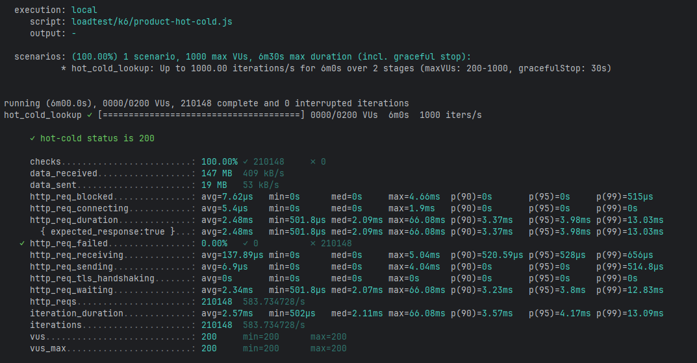

# Benchmark

상품 조회 캐시 적용 효과를 DB only 모드와 cache enabled 모드로 비교한 k6 부하 테스트 기록이다. k6 `--summary-export` 결과는 `loadtest/results/`에 보관한다.

## 측정 환경

| 항목 | 값 |
|---|---|
| 측정 도구 | k6 v0.34.1 |
| 실행 방식 | local |
| 데이터셋 | `loadtest/sql/seed-products.sql` 기준 10,000건 |
| App | `product-api` local bootRun |
| DB | MySQL 8.0 Docker Compose |
| Cache | Redis 7 Docker Compose |
| 비교 모드 | `PRODUCT_CACHE_ENABLED=false` vs `true` |
| 측정 시간 | 각 시나리오 6분 |

측정의 한계: 본 결과는 단일 호스트에서 App, DB, Redis, k6를 함께 실행한 측정값이다. 실제 운영 환경의 네트워크 latency, DB 디스크 I/O 부하, JVM 워밍업 후 정상 상태가 충분히 반영되지 않을 수 있다. 상대적 개선폭(Before/After delta)의 신뢰도는 높지만 절대 수치(예: p99 17ms)는 환경에 따라 달라질 수 있다.

## 시나리오

| 시나리오 | 스크립트 | 목표 부하 |
|---|---|---|
| 단건 조회 | `loadtest/k6/product-single.js` | 최대 1,000 iters/s, 6분 실행 |
| 다건 조회 | `loadtest/k6/product-batch.js` | 20 ids/request, 최대 500 iters/s, 6분 실행 |
| Hot/Cold 조회 | `loadtest/k6/product-hot-cold.js` | 90% hot key, 10% cold key, 최대 1,000 iters/s, 6분 실행 |

## k6 결과



| 시나리오 | 모드 | Checks | 실패율 | avg | p50 | p90 | p95 | p99 | max | 처리량 |
|---|---|---:|---:|---:|---:|---:|---:|---:|---:|---:|
| 단건 조회 | DB only | 204,881 | 0.00% | 117.22ms | 4.57ms | 478.34ms | 1106.62ms | 1318.34ms | 1908.62ms | 568.40 req/s |
| 단건 조회 | Cache enabled | 210,148 | 0.00% | 3.61ms | 2.16ms | 9.18ms | 13.05ms | 17.19ms | 123.72ms | 583.74 req/s |
| 다건 조회 | DB only | 105,148 | 0.00% | 4.01ms | 3.73ms | 5.23ms | 5.80ms | 7.26ms | 74.51ms | 292.07 req/s |
| 다건 조회 | Cache enabled | 105,149 | 0.00% | 4.84ms | 2.76ms | 4.75ms | 13.33ms | 29.39ms | 260.21ms | 292.08 req/s |
| Hot/Cold 조회 | DB only | 209,777 | 0.00% | 16.65ms | 4.02ms | 27.82ms | 92.09ms | 246.34ms | 819.07ms | 582.55 req/s |
| Hot/Cold 조회 | Cache enabled | 210,149 | 0.00% | 3.23ms | 2.14ms | 4.99ms | 11.60ms | 16.86ms | 100.71ms | 583.73 req/s |

## Cache Metric Delta

Cache enabled 모드는 actuator 누적 카운터의 테스트 전후 값을 빼서 delta를 계산했다.

| 시나리오 | fallback 시작 | fallback 종료 | fallback delta | DB fallback QPS | read hit delta | read miss delta | Redis hit ratio |
|---|---:|---:|---:|---:|---:|---:|---:|
| 단건 조회 | 23,134 | 33,135 | 10,001 | 27.78/s | 423,394 | 36,906 | 91.98% |
| 다건 조회 | 33,135 | 53,131 | 19,996 | 55.54/s | 4,225,956 | 59,988 | 98.60% |
| Hot/Cold 조회 | 53,131 | 56,033 | 2,902 | 8.06/s | 423,197 | 8,709 | 97.98% |

## Before / After 요약

DB only 모드에서는 캐시 계층을 우회하므로 Redis hit ratio는 N/A다. DB 부하 감소율은 같은 테스트 부하에서 DB only 처리량과 cache enabled fallback QPS를 비교해 계산했다.

| 시나리오 | p99 변화 | DB 부하 변화 | 해석 |
|---|---:|---:|---|
| 단건 조회 | 1318.34ms -> 17.19ms (-98.7%) | 568.40/s -> 27.78/s (-95.1%) | cache hit가 누적되면서 tail latency와 DB 부하가 함께 크게 감소 |
| 다건 조회 | 7.26ms -> 29.39ms (+304.8%) | 5841.40 item/s -> 55.54/s (-99.0%) | 로컬 단건성 DB 조회가 매우 빠른 조건에서는 cache merge/직렬화 비용 때문에 p99가 악화됐지만 DB 부하는 크게 감소 |
| Hot/Cold 조회 | 246.34ms -> 16.86ms (-93.2%) | 582.55/s -> 8.06/s (-98.6%) | hot key 재사용 효과로 cache hit ratio가 높고 fallback이 낮게 유지됨 |

## 해석

- 단건 조회는 DB only p99가 1318.34ms까지 상승했지만 cache enabled 모드에서는 17.19ms로 내려갔다.
- 단건 조회는 최대 1,000 iters/s, 다건 조회는 최대 500 iters/s로 의도적으로 다른 부하를 인가했다. 단건 DB only 모드에서 p99가 1318.34ms까지 상승한 것은 DB 자체 성능의 절대값이라기보다 같은 머신에서 동시 부하가 DB connection pool 한계에 도달한 결과로 해석한다.
- Hot/Cold 조회는 운영 환경의 hot key 패턴에 가까운 조건에서 p99 93.2% 개선, DB 부하 98.6% 감소를 확인했다.
- 다건 조회는 latency만 보면 cache enabled p99가 DB only보다 나빴다. 다만 요청당 20개 item 기준 DB 접근량은 약 99.0% 감소했다. 이 결과는 포트폴리오 문서에서 성능 개선을 과장하지 않고, 캐시가 latency와 DB 보호 사이의 trade-off를 가진다는 근거로 사용한다.

## Metric 계산 방식

### DB 부하

DB only 모드는 캐시를 우회하므로 요청량 자체를 DB 부하로 본다. 다건 조회는 요청당 20개 상품을 조회하므로 item/s로 환산한다.

```text
DB only 단건/HotCold DB 부하 = http_reqs rate
DB only 다건 DB 부하 = http_reqs rate * 20
Cache enabled DB 부하 = product.cache.fallback.items{result="requested"} delta / 측정 초
```

### Redis Hit Ratio

```text
Redis hit ratio = hit delta / (hit delta + miss delta)
```

조회 명령:

```powershell
Invoke-RestMethod "http://localhost:8080/actuator/metrics/product.cache.fallback.items?tag=result:requested"
Invoke-RestMethod "http://localhost:8080/actuator/metrics/product.cache.read.items?tag=result:hit"
Invoke-RestMethod "http://localhost:8080/actuator/metrics/product.cache.read.items?tag=result:miss"
```

## README Highlight 반영값

```md
- 단건 조회 p99 **1318.34ms -> 17.19ms**, DB 부하 **568.40/s -> 27.78/s (-95.1%)** *(k6 측정, `docs/benchmark.md` 참고)*
```
