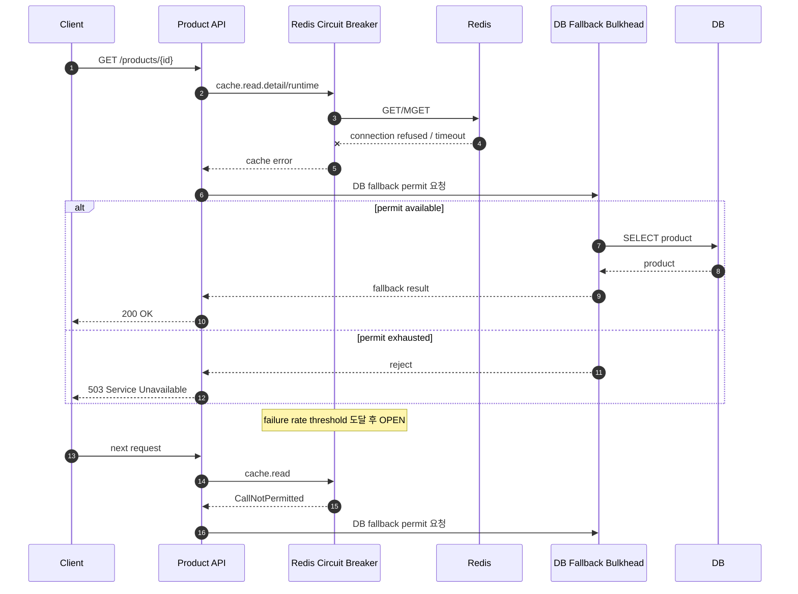
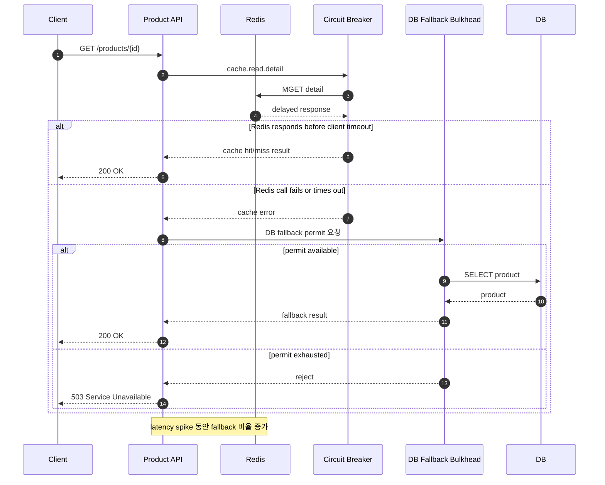
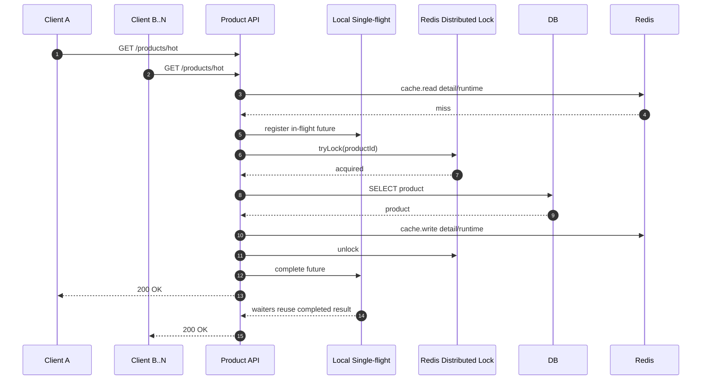
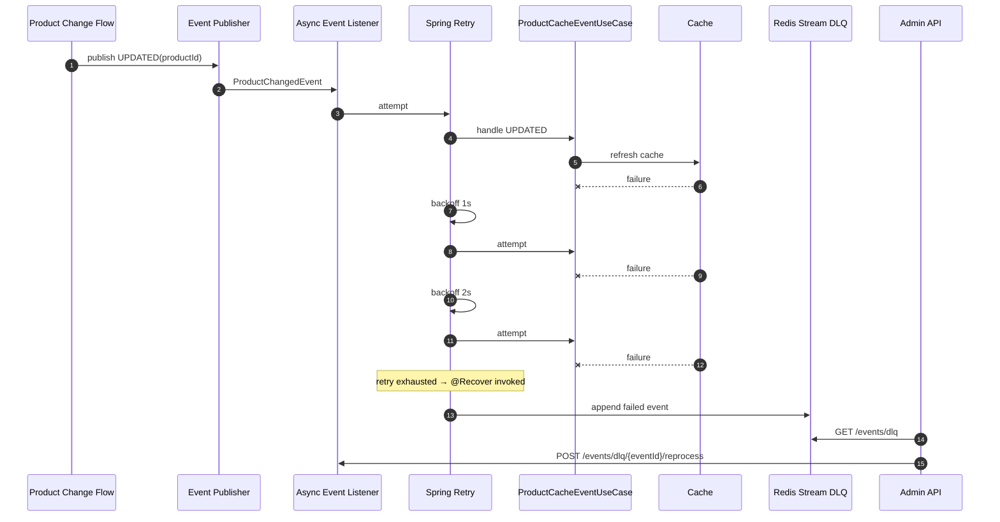

# 장애 시나리오 케이스 스터디

이 문서는 Product Cache Service가 캐시 계층 장애, hot key 폭주, 이벤트 유실 상황에서 어떤 방식으로 서비스를 보호하는지 설명한다. 각 케이스는 운영자가 실제 장애 대응 중 확인해야 할 증상, 시스템 동작, 관측 지표, 복구 메커니즘, 액션을 기준으로 정리했다.

## 1. Redis 완전 다운

### 증상

Redis 프로세스가 내려가거나 네트워크가 완전히 단절되면 detail/runtime/not-found cache read/write가 모두 실패한다. 일반적인 cache-aside 구조에서는 모든 요청이 DB fallback으로 흘러가며 DB connection pool과 query latency가 급격히 상승한다. 이 서비스는 Redis 호출 실패가 일정 임계치를 넘으면 Circuit Breaker를 open 상태로 전환하고, 이후 캐시 호출을 빠르게 우회한다.

### 시스템 동작

### 관측 지표 변화

| 지표 | 기대 변화 |
|---|---|
| `product.cache.circuit.state{state="open"}` | `1`로 전환 |
| `product.cache.read.items{result="error"}` | Redis 장애 직후 증가 |
| `product.cache.fallback.items{result="requested"}` | cache miss/장애로 증가 |
| `product.cache.fallback.rejected` | Bulkhead 포화 시 증가 |
| `http_server_requests_seconds` p95/p99 | DB fallback 비율에 따라 상승 |

### 복구 메커니즘

Circuit Breaker는 open 상태에서 Redis 호출을 차단해 장애 Redis로 인한 thread 점유를 줄인다. 설정된 대기 시간이 지나면 half-open으로 전환되어 제한된 호출만 Redis에 보내고, 성공률이 회복되면 closed로 돌아간다. DB fallback은 semaphore Bulkhead로 감싸서 Redis 장애가 DB 장애로 전파되는 것을 제한한다.

### 운영자 액션

- Grafana에서 `Redis Circuit State`, `Fallback Rate`, `Product API p99 Latency` 패널을 확인한다.
- `product.cache.fallback.rejected`가 증가하면 임시로 트래픽 제한 또는 read-only degraded 공지를 검토한다.
- Redis 컨테이너/노드 상태, 네트워크, Redis maxmemory/connection 설정을 확인한다.
- Redis 복구 후 `product.cache.circuit.state{state="closed"}`가 `1`로 돌아오는지 확인한다.
- 복구 직후 cache warm-up 또는 rebuild API 실행 여부를 판단한다.

## 2. Redis 일시 Latency 급증

### 증상

Redis가 완전히 죽지는 않았지만 latency가 급격히 상승하면 API thread가 Redis 응답을 기다리면서 전체 응답 시간이 늘어난다. 이 상황은 Redis CPU spike, slow command, 네트워크 지연, persistence 작업, noisy neighbor 등으로 발생할 수 있다. 완전 다운과 달리 일부 cache hit은 성공할 수 있으므로 fallback과 hit ratio가 동시에 흔들린다.

### 시스템 동작

### 관측 지표 변화

| 지표 | 기대 변화 |
|---|---|
| `http_server_requests_seconds` p95/p99 | Redis 대기 시간만큼 상승 |
| `product.cache.read.items{result="hit"}` | 일부 유지 가능 |
| `product.cache.read.items{result="error"}` | timeout/connection error 발생 시 증가 |
| `product.cache.fallback.items{result="requested"}` | cache error 또는 miss 증가에 따라 상승 |
| `product.cache.circuit.state{state="half_open"}` | 장애 후 회복 구간에서 일시 증가 가능 |

### 복구 메커니즘

일시 latency 장애가 실패율 임계치를 넘으면 Circuit Breaker가 open으로 전환되어 Redis 접근을 줄인다. Redis가 다시 정상 응답하면 half-open 검증 호출을 거쳐 closed로 복귀한다. DB fallback은 Bulkhead 한도 내에서만 수행되므로 Redis 지연이 DB 동시 호출 폭증으로 이어지는 것을 제한한다.

### 운영자 액션

- Redis slowlog, CPU, memory, network I/O, connection 수를 확인한다.
- Grafana에서 p99 latency와 fallback rate가 동시에 상승했는지 확인한다.
- Circuit이 open으로 전환되지 않았는데 p99만 상승하면 Redis client timeout 설정과 command latency를 우선 점검한다.
- 장애가 반복되면 Redis shard/replica, hot key 분산, command pipeline batch 크기 조정을 검토한다.
- 회복 후 hit ratio가 정상 범위로 돌아오는지 확인한다.

## 3. Hot Key TTL 동시 만료

### 증상

트래픽이 특정 상품 ID에 집중된 상태에서 detail/runtime cache가 동시에 만료되면 많은 요청이 같은 순간 DB fallback을 시도한다. TTL jitter는 서로 다른 key의 만료 시점은 분산하지만, 동일 hot key 하나가 만료되는 순간의 동시 요청은 막지 못한다.

### 시스템 동작

### 관측 지표 변화

| 지표 | 기대 변화 |
|---|---|
| `product.cache.read.items{result="miss"}` | hot key 만료 직후 일시 증가 |
| `product.cache.fallback.items{result="requested"}` | 요청 수가 아니라 single-flight 결과에 가까운 낮은 증가 |
| 애플리케이션 로그/trace | lock 획득 실패 후 cache 재조회 또는 fallback degrade 여부 확인 |
| DB QPS | 전체 요청 수 대비 제한적으로 증가 |
| `http_server_requests_seconds` p99 | lock 대기 요청 때문에 짧게 상승 가능 |

### 복구 메커니즘

JVM 내부에서는 `ConcurrentHashMap<Key, CompletableFuture<Value>>` 기반 local single-flight가 동일 인스턴스 내 중복 DB 조회를 제거한다. 인스턴스 간에는 Redis 분산 락이 같은 상품 ID에 대한 DB fallback을 하나로 수렴시킨다. lock 획득에 실패한 요청은 짧은 backoff 후 캐시를 재조회해 선행 요청이 채운 값을 사용한다. 재조회 후에도 detail/runtime 중 하나라도 비어 있으면 제한적으로 DB fallback을 수행하므로, fallback rate가 요청량과 같은 속도로 증가하지 않는지 확인한다.

### 운영자 액션

- cache miss rate, fallback rate, DB QPS를 함께 확인한다.
- fallback rate가 요청량과 비례해 치솟으면 lock 획득 실패, lease time 부족, Redis lock 장애를 의심한다.
- hot key가 반복적으로 문제를 일으키면 TTL, jitter 폭, pre-warm 대상, early refresh 도입 여부를 검토한다.
- DB p99가 함께 튀면 bulkhead 한도와 single-flight lock lease time을 점검한다.

## 4. UPDATED 이벤트 유실

### 증상

상품 변경 이벤트(`UPDATED`)가 발생했지만 캐시 갱신 중 Redis 장애, DB 조회 실패, 직렬화 오류 등으로 이벤트 처리가 실패할 수 있다. 단순 비동기 이벤트 리스너는 예외를 로그로만 남기고 종료될 수 있어, 캐시가 오래된 상태로 남는 위험이 있다.

### 시스템 동작

### 관측 지표 변화

| 지표 | 기대 변화 |
|---|---|
| `product.cache.event.handled{result="error"}` | 이벤트 처리 실패 시 증가 |
| `product.cache.event.retry` | 재시도 attempt마다 증가 |
| `product.cache.event.dlq` | 최종 실패 후 증가 |
| `product.cache.write.items{result="error"}` | cache write 실패 원인일 때 증가 |
| trace span `cache.write` | 실패 이벤트의 원인 구간 확인 가능 |

### 복구 메커니즘

이벤트 리스너는 Spring Retry를 통해 최대 3회 재시도한다. 기본 backoff는 1초, 2초, 4초 흐름이며 설정값으로 조정 가능하다. 모든 재시도가 실패하면 이벤트는 Redis Stream 기반 DLQ에 저장된다. 운영자는 관리자 API로 DLQ 이벤트를 조회하고, 장애 원인 제거 후 재처리 API를 호출해 같은 이벤트를 다시 처리할 수 있다.

### 운영자 액션

- `GET /admin/cache/products/events/dlq`로 실패 이벤트 목록을 확인한다.
- 실패 사유가 Redis 장애인지, DB 데이터 부재인지, 직렬화 문제인지 확인한다.
- 장애 원인을 제거한 뒤 `POST /admin/cache/products/events/dlq/{eventId}/reprocess`를 호출한다.
- 재처리 후 DLQ에서 해당 이벤트가 삭제됐는지 확인한다.
- 같은 productId 이벤트가 반복적으로 DLQ에 쌓이면 해당 상품 데이터 또는 캐시 직렬화 호환성을 점검한다.
